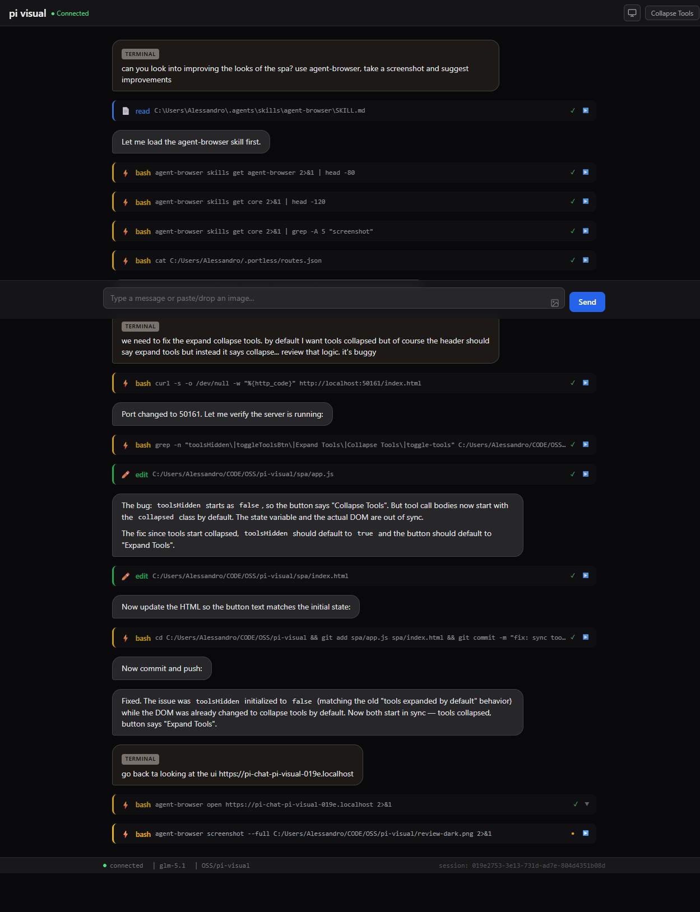
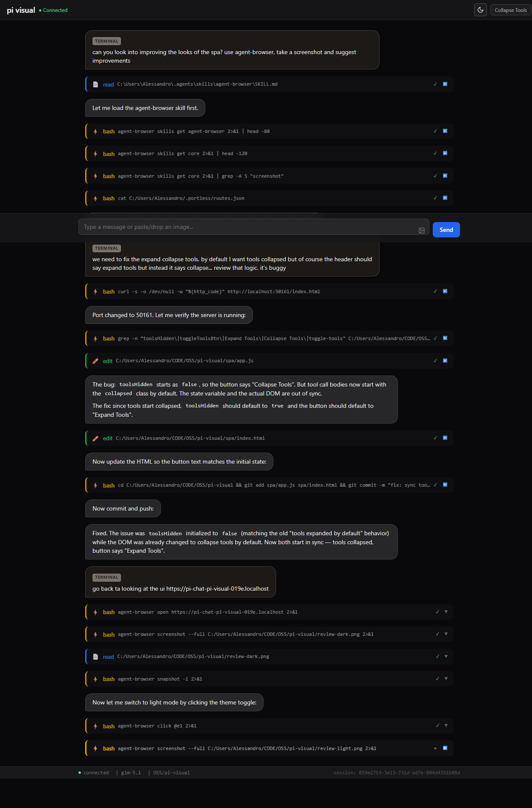

# pi-visual

A [pi](https://github.com/earendil-works/pi-coding-agent) extension that renders LLM responses as interactive visual blocks in a browser — diagrams, charts, choices, diffs, trees, and more.

Turn your terminal coding agent into a rich visual experience with **23 block types**, **bidirectional chat**, **dark/light themes**, and **live tool call visibility**.

https://github.com/user-attachments/assets/edee1243-ec8b-42fc-a1a2-7deb84b4e8eb

## Features

- 🎨 **23+ visual block types** — charts, diagrams, code, interactive forms, and more
- 💬 **Bidirectional chat** — send messages and images from the browser, see full conversation history
- 🌓 **Dark / Light / System theme** — Telegram-style circular reveal animation
- 🔧 **Live tool call visibility** — see which tools the agent calls in real time with collapsible output
- 📷 **Image support** — paste images in the browser or terminal, rendered inline
- 🔗 **Portless integration** — optional HTTPS `.localhost` URLs (auto-detected)
- 📜 **Slash command autocomplete** — discover and run commands from the browser
- 📊 **Status bar** — shows model, session, and connection info
- ♻️ **Auto-reconnection** — exponential backoff if the WebSocket drops
- ⚡ **Zero build step** — extension runs via jiti, SPA uses CDN dependencies

## Installation

```bash
# Quick test (from a local clone)
pi -e /path/to/pi-visual/src/index.ts

# Or install as a package
pi install /path/to/pi-visual
```

### Optional: Portless (HTTPS URLs)

If you have [portless](https://github.com/psychedelic-platypus/portless) installed, pi-visual will auto-detect it and offer to use a named `.localhost` URL with HTTPS instead of `http://localhost:PORT`.

## Usage

```
/visual          → toggle visual mode on/off
/visual on       → enable
/visual off      → disable
/visual status   → show current state, URL, and stats
```

When visual mode is active, the `visual` tool becomes available to the LLM. It renders structured blocks in a browser window that opens automatically.

## How It Works

1. `/visual` starts an HTTP+WebSocket server on a random port and opens your browser
2. The LLM calls the `visual` tool with structured JSON blocks
3. Blocks are pushed to the browser via WebSocket and rendered with a component library
4. You chat, click choices, or paste images in the browser — interactions flow back to pi
5. Assistant responses, tool calls, and thinking indicators stream back to the browser in real time

## Block Types (23 total)

### Structure
| Block | Description |
|-------|-------------|
| `tree` | Collapsible tree with icons |
| `table` | Data table with headers and rows |
| `list` | Styled list with badges and icons |

### Process
| Block | Description |
|-------|-------------|
| `flowchart` | Top-down flowchart diagram (D3) |
| `steps` | Ordered steps with status indicators (done/current/pending) |
| `state_machine` | State diagram with labeled transitions (D3) |

### Comparison
| Block | Description |
|-------|-------------|
| `comparison` | Side-by-side attribute cards |
| `diff` | Split-view code diff with syntax highlighting |
| `pros_cons` | Two-column pros/cons layout |

### Data Visualization
| Block | Description |
|-------|-------------|
| `chart` | Bar, line, pie, radar, and scatter charts (Chart.js) |
| `timeline` | Vertical timeline with events and colors |
| `heatmap` | Color-coded matrix with configurable palette |

### Relationships
| Block | Description |
|-------|-------------|
| `graph` | Force-directed node graph with labeled edges (D3) |
| `mind_map` | Radial mind map with nested branches (D3) |
| `entity_relation` | Entity-relationship diagram (D3) |

### Interaction
| Block | Description |
|-------|-------------|
| `choice` | Selectable cards (single or multi select) |
| `form` | Input fields (text, select) with submit |
| `checklist` | Toggleable items |

### Media
| Block | Description |
|-------|-------------|
| `explanation` | Title + body card |
| `image` | Image with optional caption |
| `svg` | Sandboxed SVG renderer |
| `code` | Syntax-highlighted code (highlight.js) |
| `markdown` | Full markdown rendering (Marked) |

## Interactive Features

- **"Tell me more" buttons** on choice options, graph nodes, table rows, timeline events, and list items
- **"Pros/Cons Analysis" button** auto-generated on choice blocks with 2+ options
- **Bidirectional chat** — persistent text input at the bottom of the browser with text and image paste support
- **Tool call streaming** — see tool names, arguments, and results in real time, collapsible by default
- **Thinking/working indicators** — animated dots while the agent is processing
- **Terminal sync** — messages typed in the terminal appear in the browser, and vice versa
- **Auto-reconnection** — reconnects with exponential backoff if the connection drops

## Screenshots

| Dark Theme | Light Theme |
|-----------|-------------|
|  |  |

## Architecture

```
pi extension (TypeScript/jiti)         Browser SPA (vanilla JS)
├── src/                               ├── spa/
│   ├── index.ts    (/visual cmd,      │   ├── index.html
│   │                event handlers)    │   ├── styles.css  (Tailwind)
│   ├── server.ts   (HTTP+WebSocket)   │   └── app.js      (all renderers)
│   ├── protocol.ts (shared types)     │
│   ├── tool.ts     (visual tool)      │
│   └── debug.ts    (debug logging)    │
```

- Extension runs via jiti (no build step)
- SPA uses Tailwind CSS, D3, Chart.js, highlight.js, Marked via CDN
- All block renderers inlined in `app.js` (no ES module path issues)
- Debug logging gated behind `PI_VISUAL_DEBUG` env var

## Development

```bash
# Run with debug logging
PI_VISUAL_DEBUG=1 pi -e src/index.ts

# Run with a specific session
pi -e src/index.ts
```

## License

MIT
